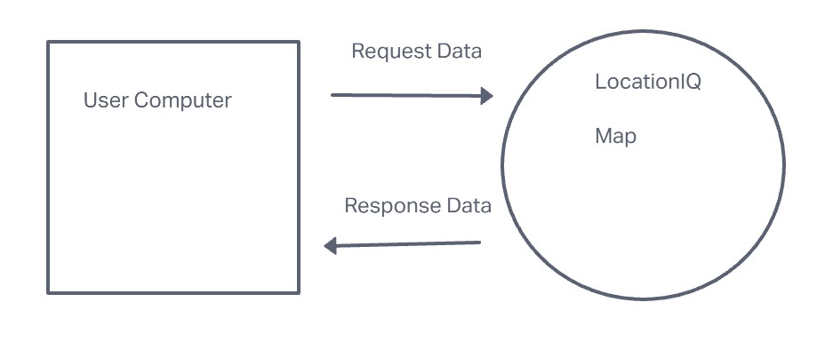
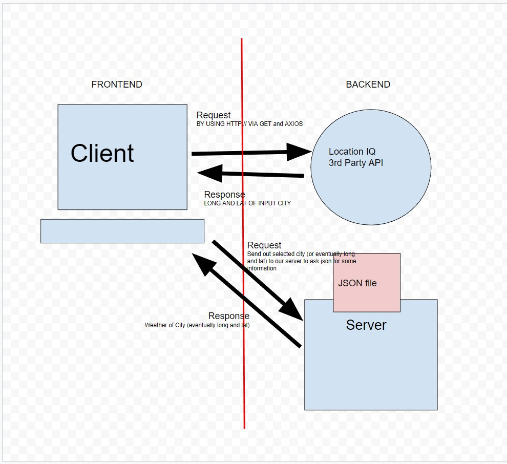
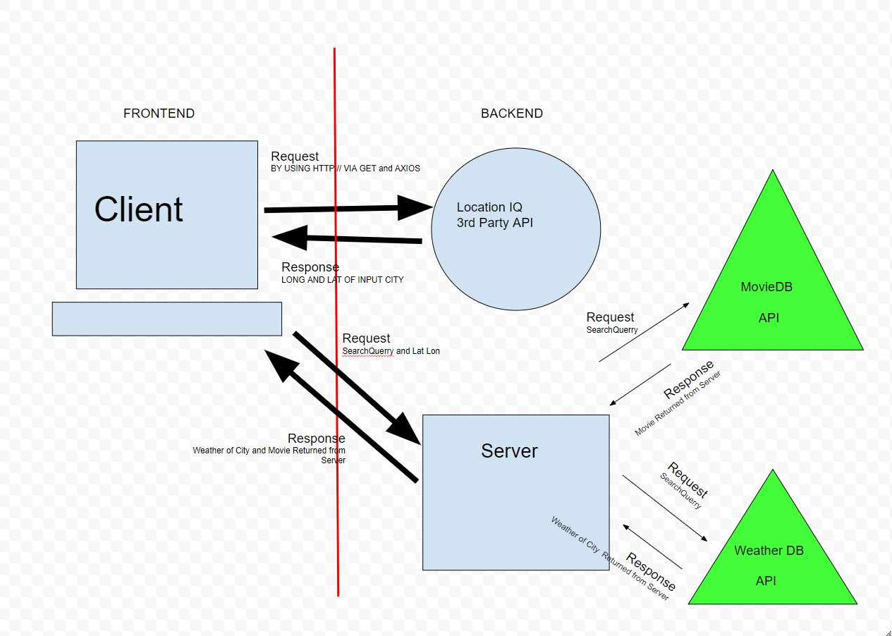

# City Explorer

**Author**: Daniel Awesome
**Version**: 1.0.7

## Overview

This is an app designed to allow a user to enter a locations name and see it on the map as well as retrive a little technical data about the location such as latitude and longitude.

## Getting Started

1. Clone the repository.
2. Create a .env file in the root.
3. Using the key in the .env.sample file, copy it and paste it into your .env file and replace the value with your own key.

## Architecture

This project was made using:

- React.js
- React BootStrap
- Axios
- LocationIQ
- Netlify.com (for deploying the site)

## Change Log

Ver. 1.0.1 08-22-2022 4:33pm - Application now has a text entry field allowing a user to search for a city and recive basic information and a visual map of the location

Ver. 1.0.2 08-22-2022 6:19pm - Styled the application and added minor error handling for empty strings in the input field

Ver. 1.0.3 08-22-2022 7:52pm - Reworked styling to include React Bootstrap elements and added error logging with on screen representation

Ver. 1.0.4 08-23-2022 5:56pm - Changed the search results to query for weather data in addition to the citymap.

Ver. 1.0.5 08-23-2022 11:24pm - Handled data transfer and display on the front end as well as passing errors from server to client

Ver. 1.0.6 08-24-2022 2:43pm - Prep for server handling of API calls and setup of readme file to reflect todays feature implimentation tracking

Ver. 1.0.7 08-24-2022 6:33pm - Retargeted calls for weather data.

## Credit and Collaborations

The following are resources used to help create the layout and functionality of this app:

- [React Bootstrap Documents](https://react-bootstrap.github.io/)

- [Location IQ Documents](https://locationiq.com/)

## Data Flow Chart

### Class 06 Data Flow Chart

### Class 07 Data Flow Chart

### Class 08 Data Flow Chart

## Feature Implimentation Tracking

`Name of feature: Asynchronous Code & APIs`

Estimate of time needed to complete: 4 hours

Start time: 2:15  

Finish time: 7:47

Actual time needed to complete: 5.45 hours

`Name of feature: Custom Servers with Node and Express`

Estimate of time needed to complete: 10hours

Start time: 3pm

Finish time: 11:30pm

Actual time needed to complete: 8

`Name of feature: API's`

Estimate of time needed to complete: 6 hours

Start time: 2:30pm

Finish time: _____

Actual time needed to complete: _____
